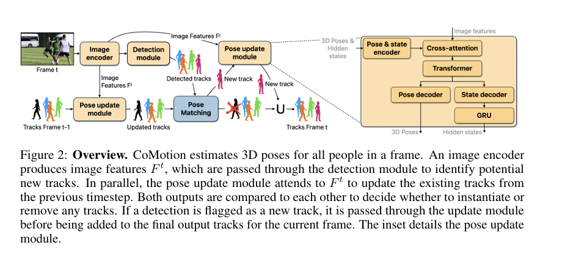

-  **CoMotion: Concurrent Multi-Person 3D Motion, ICLR 2025**

 > **단안 RGB 영상을 한 프레임씩 받아 여러 사람의 3D 자세와 ID를 동시에 유지하면서 온라인으로 추적하는 모델**이다. 기존처럼 매 프레임 사람을 새로 검출한 뒤 연결하는 것이 아니라, **이전 사람의 상태(track)를 다음 프레임의 이미지 정보를 보고 직접 업데이트한다.**
 
 
# 사전 지식

> [!사전 지식] 
> - HMR2.0
> - jitter


---

# Abstract

## 1.이 논문이 해결하려는 문제

- 입력은 **한 대의 monocular RGB camera로 찍은 영상**이다.
- 모델은 동시에 다음을 해야 한다.

```
영상
 ↓
여러 사람 검출
 ↓
각 사람의 3D Pose 추정
 ↓
누가 누구인지 ID 유지
 ↓
시간에 따라 계속 추적
```

- 특히 어려운 건:
	- 사람이 여러 명 있음
	- 서로 가림(Occlusion)
	- 자세가 복잡함
	- 실시간처럼 미래 frame을 볼 수 없음
	- 사람이 가려져도 track을 유지해야 함

- 핵심 아이디어는 **per-frame detection + learned pose update**다.

---
# Introduction

## 1. 저자들이 원하는 시스템

- 저자들은 좋은 시스템이라면 네 가지를 동시에 해야 한다고 본다.
	
	- 1. 여러 사람을 볼 수 있어야 함
	- 2. 각 사람의 자세를 3D로 추정
	- 3. 영상 전체에서 같은 사람을 계속 추적
	- 4. 미래 frame을 보지 않고 **online**으로 처리

- 즉,

```
Frame 1 → Frame 2 → Frame 3 → ...
   ↑         ↑         ↑
현재와 과거 정보만 사용
```

## 2. 기존 방법의 문제: Detect-and-Associate

- 기존 방법은 대체로 아래 구조.

```
Frame t
 ↓
사람 Detection
 ↓
Pose estimation
 ↓
이전 Frame의 사람과 Matching
```


- 즉 매 frame에서 독립적으로 사람을 찾고, "이번 frame의 이 사람은 지난 frame의 누구였지?"를 나중에 연결한다.

- 문제는 **Detection이 한 번 실패하면 track 자체가 끊길 수 있다는 것**이다. 


## 3. CoMotion의 핵심 아이디어

- CoMotion은 반대로 생각한다.

```
이전 Frame에서 추적 중인 사람
          ↓
      Track State
          ↓
새 Frame의 Image Feature를 봄
          ↓
현재 사람의 Pose로 직접 Update
```

- 즉, **새 frame마다 사람을 처음부터 다시 찾는 것이 아니라, 이미 추적 중인 사람의 상태를 새 이미지로 갱신한다.**
- 이걸 논문에서는 **tracking-by-attention** 방식으로 설명한다. 

## 4. 왜 Occlusion에 유리한가

- 예를 들어 사람 몸 전체가 안 보이고 발만 조금 보인다고 하자.

- 일반 detector 입장에서는 "이게 사람인가?" 하고 검출에 실패할 수도 있다.

- 하지만 CoMotion은 이미  "저 위치 근처에 A라는 사람이 있었고 이렇게 움직이고 있었다."라는 과거 정보를 가지고 있다.

- 그래서 작은 이미지 단서만으로도 **기존 track을 계속 업데이트할 수 있다.** 

## 5. 데이터 문제

- 문제는 이런 모델을 학습할 좋은 데이터가 거의 없다는 것이다.

- 특히 여러 사람이 복잡한 실제 환경에서 움직이는 영상 + 정확한 3D pose + tracking ID가 모두 붙어 있는 데이터가 부족하다.

- 그래서 여러 종류의 dataset을 섞고 **pseudo-labeling**까지 사용한다. 

---
# Related Work
- 저자들은 기존 연구를 **두 기준**으로 나눈다.

```
                Single Person      Multi Person
Single Frame        ①                  ③

Video               ②                  ④
```

- CoMotion은 **④ Multi-person + Video**에 해당한다. 

## 1. Single-person, Single-frame 3D Pose

```
사진 한 장
 ↓
사람 한 명
 ↓
3D Pose / SMPL
```

- HMR2.0 같은 일반적인 HMR 연구들이 여기에 해당한다.
- 단점은 **시간 정보가 없고 여러 사람 tracking을 하지 않는다.** 

## 2. Single-person Pose from Video

```
한 사람의 Video
 ↓
시간 정보 활용
 ↓
3D Motion
```

- VIBE처럼 GRU를 쓰는 방법들이 있다.

- 하지만 보통 이미 사람이 crop되고 tracking되어 있다는 것을 가정한다.

- 즉 **외부 tracker가 필요하다.**

- CoMotion은 외부 tracker 없이 모델 자체가 여러 사람을 추적한다는 차이가 있다. 

## 3. Multi-person, Single-frame

```
사진 한 장
 ↓
여러 사람
 ↓
각 사람의 3D Pose
```

- 최근에는 image feature에 여러 query token을 cross-attention해서 여러 사람을 한 번에 찾기도 한다.

- 하지만 역시 **시간적인 tracking은 없다.** 

## 4. Multi-person Pose from Video

- CoMotion과 가장 직접적으로 비교되는 분야다.
- 대표적으로:
	- PHALP
	- 4D Humans
- 4D Humans 같은 방법은 대체로  **tracking-by-detection** 방식이다.
```
Frame마다 사람 검출
 ↓
각 사람 Pose 계산
 ↓
Frame 사이에서 Matching
```

- CoMotion은 아래 방식이 가장 큰 차이다.

```
기존 Track
 +
현재 Image Feature
 ↓
Track 자체를 직접 Update
```

---
# CoMotion Architecture


```
Current Frame
      ↓
 Image Encoder
      ↓
Image Feature Ft
   ↙        ↘
Detection   Pose Update
Module       Module
   ↓           ↓
새로운 사람   기존 사람 갱신
      ↘       ↙
     Track Management
           ↓
 현재 Frame의 모든 Track
```

- Figure 2가 이 구조를 보여준다. 



## 1. 입력과 출력

- 입력: I1, I2, ... It  즉 monocular RGB video다.

- 출력 : 매 시간마다 사람별 **SMPL parameter**다.

- SMPL로 표현하는 정보는 크게:
	- `γ` : 사람의 3D 위치(translation)
	- `θ` : Pose
	- `β` : Body Shape

- 중요한 것은 **future frame은 사용하지 않는다.**

## 2.  Image Encoder

- 현재 frame을 **ConvNeXtV2 Image Encoder**에 넣는다.

```
Current Image It
       ↓
   ConvNeXtV2
       ↓
Image Feature Ft
```

- Detection Module과 Pose Update Module이 **같은 Ft를 사용한다.**

## 3. Detection Module

- Detection Module의 역할은 **현재 영상에 새롭게 등장한 사람 후보를 찾는 것**이다.
- 각 위치에서 단순 bounding box만 출력하는 것이 아니라 사람의 3D 정보를 직접 예측한다.
	- SMPL Pose,
	- 3D 위치,
	- Body Shape,
	- Confidence
- 후보가 많이 나오기 때문에 NMS로 중복을 제거한다. 

```
Image Feature
 ↓
Detection Module
 ↓
"새로운 사람 후보들"
```


## 4. Pose Update Module 

- 여기가 **CoMotion의 진짜 핵심**이다.
- 이전 frame에 A라는 사람이 있었다고 하자.
- A의 이전 정보를 가지고 있다.
```
A의 기존 SMPL Pose
A의 2D Keypoints
A의 Hidden State
```

- 이걸 MLP로 **Track Token**으로 바꾼다.

- 그 다음 아래 과점 수행

```
Track Token
     ↓
Cross-Attention
     ↑
현재 Image Feature
```


- 즉 token이 현재 이미지를 보고 "이 사람이 지금 어디로 이동했고 자세가 어떻게 바뀌었는가?"를 찾아낸다. 

### 4.1 GRU Hidden State

- CoMotion에는 **GRU hidden state**도 있다.

- 쉽게 말하면 **이 사람의 과거 움직임에 관한 기억**이라고 생각하면 된다.

```
과거 Track
    ↓
Hidden State
    ↓
새 Frame
    ↓
새 Hidden State
```

- 그래서 현재 frame에 사람이 잘 안 보여도 이전 움직임 정보를 활용할 수 있다.

### 4.2사람이 안 보이면?


- 사람이 완전히 가려져서 현재 이미지에 유용한 단서가 거의 없어도 **Pose Update Module은 그 track을 계속 업데이트해야 한다.** 

- 그래서 detection에만 의존하는 방법과 차이가 생긴다.

## 5. Track Management

- 이제 문제가 하나 남는다.

```
Detection Module → 새 사람 후보
Pose Update      → 기존 사람
```

- 이 둘을 보고 아래를 결정해야 한다.

> "이 사람은 원래 있던 사람인가?"  
> "새로 등장한 사람인가?"  
> "이 track은 이제 사라진 사람인가?"

- 여기에 **OKS(Object Keypoint Similarity)**를 사용한다.
- 쉽게 말하면 두 사람의 2D 관절 위치가 얼마나 비슷한지 보는 값이다. 

- 그리고 간단한 heuristic으로 아래 수행.

```
기존 Track과 많이 다름
→ 새로운 Track 생성

오랫동안 Detection과 맞지 않음
→ Track 삭제

두 Track이 계속 거의 같은 Pose
→ 중복 Track 하나 제거
```

- 여기서 중요한 건 **이 부분은 neural network가 아니라 heuristic**이라는 점이야.

---

# Training

## 1. Datasets

- CoMotion은 한 dataset으로 학습하지 않는다.

### Single Image

- InstaVariety
- COCO
- MPII

이 데이터에는 NLF라는 3D pose model을 이용해 **pseudo-label**을 다시 만들었다. 

### Real Video

- PoseTrack
- DanceTrack

원래 정확한 3D GT가 없기 때문에 역시 **NLF로 3D pseudo-label**을 만든다. 

### Synthetic Video

- BEDLAM
- WHAC-A-MOLE

이쪽은 정확한 synthetic 3D ground truth를 사용할 수 있다. 

핵심은 3개를 합친다는 것이다.

```
Real Image
→ 다양성

Real Video
→ 실제 Tracking 상황

Synthetic
→ 정확한 3D GT
```

- SAM 3D Body 논문과 마찬가지로 **데이터 품질과 다양성이 굉장히 중요하게 등장한다.**


## 2. Training Curriculum

- CoMotion은 한 번에 모든 것을 학습시키지 않고 **3단계로 학습한다.**

### 2.1 Stage 1 — Single Frame

- 먼저 아래만 강하게 학습.

```
Image Encoder
+
Detection Module
```

- 즉 먼저 모델에게 **“사진 한 장을 보면 사람들의 3D Pose를 제대로 찾아라.”**를 가르친다. 

### 2.2 Stage 2 — Short Video

- 그 다음 Image Encoder와 Detection Module을 freeze하고 **Pose Update Module을 학습**한다.

- 8-frame 정도의 짧은 clip을 이용한다.

- 목적은 **“이전 사람의 상태를 다음 frame으로 잘 이어가라.”**를 학습하는 것.
### 2.3 Stage 3 — Long Video

- 마지막에는 더 긴 video sequence로 fine-tuning한다.

- 예를 들어 아래 프레임 사용
	- 32 frames
	- 96 frames

- 이 단계의 목적은 **장시간 tracking 안정성**을 높이는 것이다. 

### 2.4 전체 Training

```
Stage 1
사람을 잘 찾아라

       ↓

Stage 2
짧은 시간 동안 잘 따라가라

       ↓

Stage 3
긴 시간 동안 ID와 Pose를 안정적으로 유지하라
```


---

# Experiments

- 이 논문은 약간 난감한 문제가 있다.
- **CoMotion이 하는 모든 일을 동시에 평가하는 표준 benchmark가 없다.**

- 즉," Multi-person + 3D Pose + Tracking + Online"을 한꺼번에 제대로 평가하는 dataset이 없다.

- 그래서 저자들은 나눠서 평가한다.

## 1. Tracking Evaluation

- Tracking은 **PoseTrack21**에서 평가한다.

- 주요 metric:
	- MOTA
	- IDF1
	- ID Precision
	- ID Recall


- 이 평가의 핵심 질문은: **사람을 놓치지 않고 같은 ID로 계속 따라갈 수 있는가?**

- 논문에서는 CoMotion이 기존 방법보다 tracking 성능이 높고, 특히 비교 대상인 4D Humans보다 훨씬 빠르게 동작한다고 보고한다.

## 2. Pose Estimation

- Pose 자체도 잘 추정해야 한다.

- 그래서 아래 데이터셋 사용
	- COCO → 2D PCK
	- PoseTrack → 2D PCK
	- 3DPW → MPJPE / PA-MPJPE


- 일반 HMR처럼 사람만 crop해서 입력한 경우와 아예 전체 이미지를 넣은 경우를 비교한다.
- 저자들은 전체 이미지를 넣어 훨씬 어려운 문제를 풀어도 pose 성능 감소가 크지 않았다고 보고한다.
## 3. 시간적으로 더 안정적

- 4D Humans는 각 frame에서 독립적으로 Pose를 만들기 때문에 jitter가 생길 수 있다.

```
Frame 1 : 팔 40°
Frame 2 : 팔 42°
Frame 3 : 팔 110°  ← 갑자기 튐
Frame 4 : 팔 45°
```


- CoMotion은 이전 상태를 이용하기 때문에 아래처럼 더 **temporally coherent**한 결과를 낸다는 게 저자들의 중요한 주장이다. 

```
40° → 42° → 44° → 45°
```


---

# Ablation Study

## 1. GRU / Hidden State

- Hidden State를 없애면 아래 결과.
	- ID switch 증가
	- Pose 성능도 저하


- 즉 **과거 정보를 기억하는 것이 tracking에 실제로 도움이 된다.** 
## 2. Long-sequence Training

- Stage 3의 긴 영상 학습은 **한 frame의 pose 정확도를 크게 높이지는 않지만 tracking 성능을 개선**한다.

- 즉 Stage 3는 Pose 자체를 더 잘 맞추기 위한 단계라기보다 **장기간 track을 안정적으로 유지하기 위한 단계**라고 보면 된다. 

- 부록에서는 추가로 pseudo-labeled video dataset, camera intrinsics, runtime 등에 대한 실험도 더 자세히 다룬다.

---

# Conclusion


- CoMotion은 아래를 전부 하는 모델.

```
Monocular RGB Video
        ↓
여러 사람을 동시에
        ↓
3D Pose Estimation
        +
Tracking
        ↓
Online 처리
```

- 특히 **현재 이미지와 과거 track state를 함께 사용해 사람의 pose를 직접 업데이트한다**는 것이 중심 아이디어다. 
---

# Limitations

## ① Track Collapse / ID Switch

두 사람 track이 하나로 합쳐지거나,

갑자기 A를 따라가던 track이 B로 넘어가는 문제가 있다.

저자들은 모델이 아직 **physicality**, 즉 사람이 실제 물리적으로 어떻게 존재하고 움직이는지에 대한 개념이 부족하다고 본다. 


## ② 좋은 Video Training Data 부족

정확한 multi-person 3D video GT가 부족하다.

Pseudo-label을 만들 수는 있지만 특히 **사람 두 명이 가까이 붙어 있는 상황에서는 label 품질이 나빠진다.** 

아이러니하게도 바로 이런 장면이 CoMotion에서 가장 중요한 장면이다.


## ③ Train-Test Gap

- 학습할 때는 짧은 Clip, 고정된 사람 수를 사용하지만 
- 실제 추론에서는 아래 조건이다.
	- 수백 Frame
	- 사람 등장
	- 사람 퇴장
	- Track 생성/삭제 반복
- 즉 학습과 실제 사용 조건에 차이가 있다.
- 향후에는 현재 heuristic인 **Track Management 자체를 differentiable하게 학습**하는 것도 가능하다고 제안한다. 
## ④ Camera Motion / Absolute Scale

- CoMotion은 사람의 움직임은 추정하지만 **카메라 자체의 움직임을 명시적으로 모델링하지 않는다.**

- 또 absolute scale도 제대로 다루지 않기 때문에 일관된 world coordinate에서 사람을 표현하는 데 한계가 있다.

---
# Appendix


### A.1 Tracking Evaluation Details

PoseTrack18/21의 annotation과 evaluation code 문제를 분석한다. 특히 ignore region 처리 버그 때문에 올바른 detection이 false positive로 계산되는 문제를 설명한다. 
### A.2 Controlled Experiments

본문에서 짧게 다룬:

- Hidden State / GRU
- Training Stage
- Pseudo-labeled video
- Camera intrinsics
- Runtime

등을 더 자세히 실험한다.

### A.3 Additional Method Details

실제로 구현할 때 볼 부분이다.

- Image Encoder
- Detection Step
- Update Step
- Modified OKS

를 세부적으로 설명한다.

### A.4 Pseudolabeled Data

왜 기존 4D Humans의 pseudo-label 대신 **NLF로 다시 pseudo-labeling했는지** 설명한다.

핵심은 기존 label이 너무 sparse해서 군중 속 사람들을 많이 놓쳤고, 새로운 NLF label이 더 많은 사람을 포함하고 어려운 pose에서도 더 나은 supervision을 제공했다는 것이다.

---
